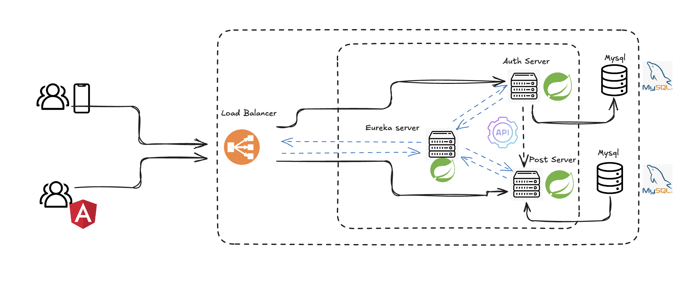

### Gateway Load Balancer Documentation

---

## Overview

The Gateway Load Balancer (GWLB) enables efficient traffic distribution across multiple instances of your application, ensuring improved fault tolerance and response time. It acts as a traffic cop, directing client requests to the servers that are most capable of fulfilling them with the shortest delay.

## Key Features

- **High Availability**: Ensures that the application remains available even if one or more servers fail.
- **Scalability**: Allows the number of servers to be scaled up or down based on traffic requirements.
- **Flexibility**: Supports multiple protocols including HTTP, HTTPS, TCP, and UDP.
- **Health Checks**: Regularly checks the health of the backend services to ensure traffic is routed only to healthy servers.

